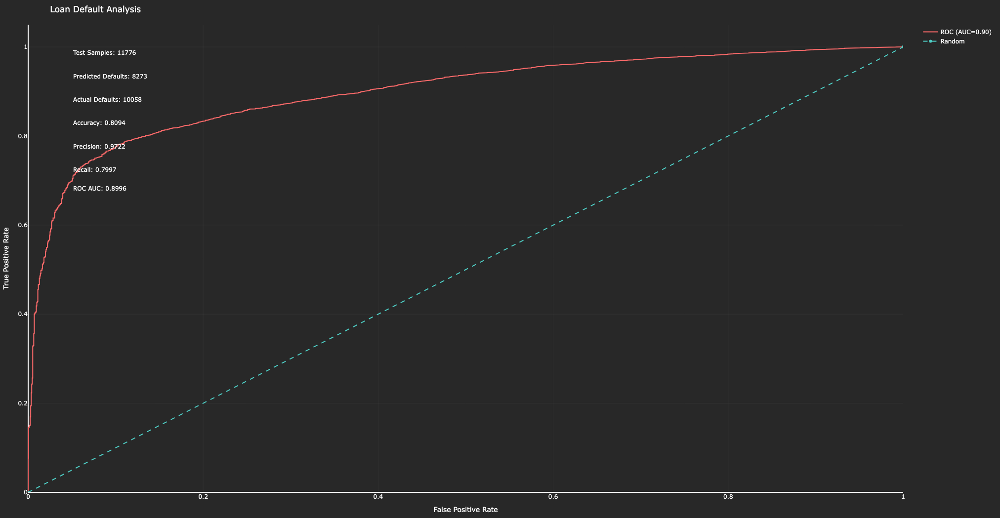

# Loan Default Prediction Model

- This project builds a machine learning model to predict loan defaults based on borrower data (e.g., credit score, income, loan amount).
- It uses a Random Forest Classifier and includes data preprocessing, model training, performance evaluation, and visualization of results.

---

## Files
- `loan_default_prediction.py`: Main script for loading data, training the model, and generating a combined ROC curve and report plot.
- `loans.csv`: Expected input dataset containing borrower data.
- `output.png`: Plot.
---

## Libraries Used
- `pandas`
- `numpy`
- `scikit-learn`
- `plotly`
- `os`

---

## Features
- **Data Preprocessing**: Handles missing values (filled with median) and scales numerical features using StandardScaler.
- **Model**: Trains a Random Forest Classifier with class weighting to handle imbalanced data.
- **Evaluation**: Computes accuracy, precision, recall, and ROC AUC; generates an ROC curve.
- **Output**: Produces an interactive Plotly visualization combining the ROC curve and a summary report.

## Screenshots

